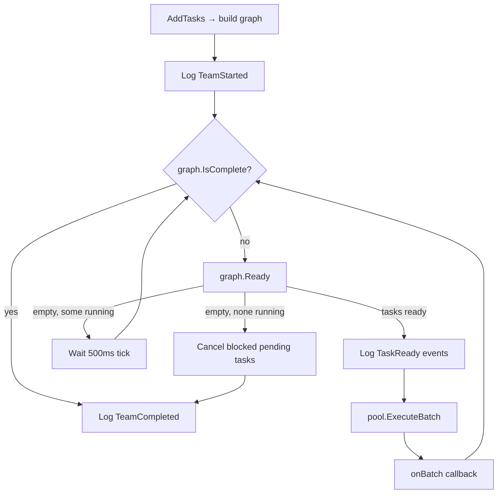

# ssenrah Harness — Architecture

## 1. Overview

ssenrah harness is a Go-based agent execution harness. It runs one or more LLM agents in a terminal UI, supporting multi-turn tool use, policy-gated execution, and team-based parallel task execution.

The codebase follows **hexagonal architecture** (ports and adapters): domain packages define interfaces and value objects; application packages implement business logic against those interfaces; infrastructure packages provide concrete adapters (providers, config, tools).

Current version: **v0.4b** — adds team execution (task DAG, worker pool, orchestrator).

---

## 2. Directory Structure

```
harness/
├── domain/           # Core types, interfaces (no external dependencies)
│   ├── shared/       # Message, ToolCall, Role, Usage, StreamChunk
│   ├── agent/        # AgentType, AgentConfig, RunOptions
│   ├── task/         # Task, TaskStatus, TaskCategory, TaskGraph
│   ├── policy/       # PolicyDecision, PolicyProfile, ToolRule, PolicyEngine
│   ├── tool/         # Tool interface, Registry, ToolResult
│   ├── event/        # EventType (16 types), Event, EventLogger
│   ├── provider/     # LLMProvider interface, ChatRequest, StreamChunk
│   ├── conversation/ # Conversation (ordered message history)
│   └── session/      # Session, KeyBinding
│
├── application/      # Business logic; depends only on domain
│   ├── agent.go      # AgentService — multi-turn execution loop
│   ├── worker_pool.go# WorkerPool — concurrent task execution
│   ├── matcher.go    # AgentMatcher — category/keyword → agent type
│   ├── orchestrator.go # OrchestratorService — DAG scheduling loop
│   └── session.go    # SessionService — UI session state
│
├── infrastructure/   # Adapters; depends on domain + application
│   ├── factory.go    # NewProvider, BuildPolicyProfiles, BuildAgentTypes
│   ├── config/       # YAML config loading, embedded defaults.yaml
│   ├── logging/      # MemoryEventLogger, event constructors
│   ├── prompt/       # System prompt loading
│   ├── tools/        # read_file, write_file, bash implementations
│   ├── dummy/        # Dummy LLM provider (testing)
│   ├── openrouter/   # OpenRouter provider
│   └── codex/        # Codex provider
│
├── tui/              # Bubble Tea terminal UI
├── prompts/          # System prompt template files
└── main.go           # Entry point: wires everything together
```

---

## 3. Domain Model

### shared
- **Role**: `user`, `assistant`, `tool`
- **Message**: `{Role, Content, ToolCalls []ToolCall, ToolCallID}`
- **ToolCall**: `{ID, ToolName, Input map[string]any}`
- **StreamChunk**: `{Delta string, Done bool, ToolCalls []ToolCall}`
- **Usage**: `{InputTokens, OutputTokens int}`

### agent
- **AgentType**: Immutable template loaded from YAML. Fields: `Name`, `Description`, `Model`, `PolicyTier`, `Tools []string`, `SystemPrompt`, `MaxTurns`.
- **AgentConfig**: Runtime config for a single run (`Name`, `Model`, `SystemPrompt`, `ToolPacks`, `PolicyTier`, `MaxTurns`).
- **RunOptions**: `{MaxTurns, SystemPrompt, Model}`.

### task
- **TaskCategory**: `explore | implement | refactor | test | verify | debug | document | generic`
- **TaskStatus**: `pending → ready → running → completed | failed | cancelled`
- **Task**: `{ID, Description, Category, AgentType, Status, Priority, BlockedBy []string, Result *TaskResult, WorkerID, CreatedAt, StartedAt, CompletedAt}`
- **TaskResult**: `{Content string, Verified bool, VerifiedBy string}` — workers submit content; orchestrator sets `Verified`.
- **TaskGraph**: Dependency-aware DAG. Enforces no-cycle invariant on `Add`. Exposes `Ready()`, `Claim()`, `Complete()`, `Fail()`, `Cancel()`, `IsComplete()`, `Stats()`.

### policy
- **PolicyDecision**: `Allow | AwaitUser | Deny`
- **ToolRule**: `{Action PolicyDecision, Reason string}`
- **PolicyProfile**: `{Name, Description, DefaultAction PolicyDecision, ToolRules map[string]ToolRule}`
- **RiskLevel**: `Low | Medium | High` (informational, used in approval UI)

### tool
- **Tool** (interface): `Name() string`, `Description() string`, `Parameters() ParameterSchema`, `Execute(ctx, input) (ToolResult, error)`
- **ToolResult**: `{CallID, Content string, IsError bool}`
- **ApprovalRequest**: `{ToolCall, RiskLevel string, Reason string}`
- **Registry**: Thread-safe map of `name → Tool`. Methods: `Register`, `Get`, `List`.

### event
16 event types across two groups:

| Group | Types |
|-------|-------|
| Agent | `tool_call`, `tool_result`, `message`, `error`, `policy_eval` |
| Team  | `team_started`, `team_completed`, `task_created`, `task_ready`, `task_assigned`, `task_completed`, `task_failed`, `worker_started`, `worker_idle`, `worker_nudged`, `worker_killed` |

**Event**: `{ID, Type EventType, Timestamp time.Time, Data map[string]any}`

**EventLogger** (interface): `Log(Event) error`

### provider
- **LLMProvider** (interface): `Name() string`, `ChatStream(ctx, ChatRequest, handler) error`, `Models(ctx) ([]ModelInfo, error)`
- **ChatRequest**: `{Model, SystemPrompt string, Messages []Message, Tools []ToolDefinition}`
- **ToolDefinition**: `{Name, Description string, Parameters map[string]any}`

### conversation
- **Conversation**: Ordered slice of `Message`. Methods: `Append`, `History`, `LastAssistantMessage`, `Clear`.

### session
- **Session**: Holds `ModelName`, `ProviderName`, status flags, and registered key bindings.
- **KeyBinding**: `{Key, Action, Description string}`

---

## 4. Application Layer

### AgentService (`application/agent.go`)
Orchestrates a single agent's multi-turn execution. Holds a `Conversation`, `LLMProvider`, `Registry`, active `PolicyProfile`, and `PolicyEngine`. Exposes:
- `Run(ctx, userMsg, eventCh)` — blocking loop; wrap in a goroutine.
- `ApplyAgentType(at, profile, reg)` — switches model, prompt, policy, and tool registry atomically.
- `SetPolicyProfile(p)` — hot-swaps policy tier; clears session approvals.

Events emitted on `eventCh`: `EventStreamChunk`, `EventToolCall`, `EventToolResult`, `EventApprovalNeeded`, `EventTurnComplete`, `EventDone`, `EventError`.

### WorkerPool (`application/worker_pool.go`)
Manages concurrent task execution for team mode. Each worker gets a **fresh** `Conversation` and `AgentService` — no shared state between workers. `AwaitUser` approvals are auto-resolved (workers run headless; policy governs access). Key method:
- `ExecuteBatch(ctx, tasks, graph)` — fans out goroutines up to `maxWorkers`, each with a `context.WithTimeout`. Blocks until all goroutines finish.

Worker lifecycle: `Idle → Running → Done | Failed`. Registered in a mutex-protected map; removed on completion.

### AgentMatcher (`application/matcher.go`)
Maps a `Task` to an agent type name. Priority chain:

1. **Manual** (confidence 1.0) — `task.AgentType` pre-set and present in registry
2. **Category** (confidence 0.9) — `task.Category` present in `categoryMap`
3. **Keyword** (confidence 0.5–0.8) — weighted keyword scoring on `task.Description`
4. **Fallback** (confidence 0.0) — uses configured `fallbackType`

`InferCategory` scores all 8 categories; confidence = `best / (best + second)` when two categories score, else 0.8 for a single match.

### OrchestratorService (`application/orchestrator.go`)
Drives the task DAG to completion. Maintains a single `TaskGraph`, an `AgentMatcher`, a `WorkerPool`, and a `Decomposer`.

- `Decompose(ctx, goal)` — calls the LLM to break a goal into tasks, adds them to the graph. Zero human intervention.
- `AddTask` / `AddTasks` — builds tasks, runs matcher, inserts into graph, validates DAG.
- `Run(ctx)` / `RunWithCallback(ctx, onBatch)` — scheduling loop (see §7).
- Owns all `graph.Complete()` / `graph.Fail()` calls — workers do not mark completion directly.

### Decomposer (`application/decomposer.go`)
Uses a single `provider.Chat()` call (non-streaming) to decompose a natural-language goal into structured `TaskSpec` entries.

- System prompt instructs the LLM to output a JSON array of `{id, description, category, blocked_by, priority}`.
- Handles common LLM failure modes: strips markdown code fences, falls back invalid categories to `"generic"`, silently drops dependencies referencing non-existent task IDs.
- Returns `[]TaskSpec` ready for `OrchestratorService.AddTasks()`.

---

## 5. Agent Loop (v0.3+)

```
User message
    │
    ▼
conversation.Append(userMsg)
    │
    ┌─────────────── turn loop (maxTurns) ───────────────┐
    │                                                      │
    ▼                                                      │
buildRequest() → ChatRequest (tools attached)             │
    │                                                      │
    ▼                                                      │
provider.ChatStream() → stream deltas → EventStreamChunk  │
    │                                                      │
    ▼                                                      │
assistantMsg assembled                                     │
conversation.Append(assistantMsg)                         │
EventTurnComplete emitted                                 │
    │                                                      │
    ├── no tool calls → EventDone → return ───────────────┘
    │
    ▼
processToolCalls():
  for each ToolCall:
    evaluatePolicy() → Allow | AwaitUser | Deny
    Allow    → execute immediately
    AwaitUser → check alwaysAllow map → EventApprovalNeeded → wait → execute or skip
    Deny     → append denial result message
    execute  → tool.Execute() → conversation.Append(result) → EventToolResult
    │
    └── loop back to buildRequest()
```

---

## 6. Policy Engine (v0.4a)

Four built-in tiers (defined in `defaults.yaml`, overridable in `harness.yaml`):

| Tier | Default Action | Notable Rules |
|------|---------------|---------------|
| `supervised` | ask | All tools require approval |
| `balanced` | ask | `read_file` → allow |
| `autonomous` | allow | `bash` → ask |
| `yolo` | allow | No per-tool overrides |

`DefaultPolicyEngine.EvaluateWithReason(tc, profile)`:
1. Check `alwaysAllow` session map (user granted "always" during a prior prompt).
2. Look up `profile.ToolRules[tc.ToolName]` — if found, return its action.
3. Return `profile.DefaultAction`.

Switching tiers (via TUI sidebar) calls `AgentService.SetPolicyProfile()`, which also calls `ResetApprovals()` to prevent stale session-level grants from bypassing a downgraded tier.

---

## 7. Team Execution (v0.4b)

### Task DAG

Tasks form a directed acyclic graph via `BlockedBy []string`. `TaskGraph.Add()` validates that all declared dependencies exist and runs DFS cycle detection before inserting. `Ready()` returns all `StatusPending` tasks whose entire `BlockedBy` set is `StatusCompleted`.

### Orchestrator Loop



### Batch Execution

`WorkerPool.ExecuteBatch` slices ready tasks to `maxWorkers`, spawns one goroutine per task (each with `context.WithTimeout`), and waits on `sync.WaitGroup`. Per worker:

1. Resolve agent type (falls back to `"default"` if unknown).
2. Register worker in mutex-protected map.
3. Log `worker_started`, `task_assigned`.
4. Build filtered `Registry` and resolved `PolicyProfile` for this agent type.
5. Create fresh `Conversation` + `AgentService`.
6. Run agent loop (`svc.Run`); collect events in background goroutine; auto-approve any `AwaitUser` that slips through headless execution.
7. On success: `graph.Complete(id, TaskResult{Verified: false})`.
8. On error/timeout: `graph.Fail(id, errMsg)`.

### Agent Matching

```
task.AgentType set + in registry → Manual  (1.0)
task.Category in categoryMap     → Category (0.9)
keyword scoring on Description   → Keyword  (variable)
nothing matched                  → Fallback (0.0)
```

Default `category_map` (from `defaults.yaml`):
```
explore   → explorer    implement → coder
refactor  → coder       test      → verifier
verify    → verifier    debug     → reviewer
document  → reviewer    generic   → default
```

### Verification Ownership

Workers submit `TaskResult{Verified: false}`. The orchestrator (or a downstream verifier task) is responsible for calling `graph.Complete()` with `Verified: true`. This enforces quality gating at the orchestration layer — workers never self-certify completion.

### Event Flow

```
TeamStarted → TaskCreated (×N) → TaskReady → TaskAssigned →
WorkerStarted → TaskCompleted | TaskFailed → ... → TeamCompleted
```

---

## 8. Configuration

Config loads in priority order: `harness.yaml` → `harness.json` (legacy) → embedded `defaults.yaml`.

Top-level structure:

```yaml
app:
  provider: "dummy"        # dummy | openrouter | codex
  model: "dummy-v1"
  theme: "dark"
  sidebar_open: true

policy_tiers:
  <name>:
    description: "..."
    default_action: "ask"  # ask | allow | deny
    tool_rules:
      <tool_name>:
        action: "allow"
        reason: "..."

agent_types:
  <name>:
    description: "..."
    model: "..."
    policy_tier: "<tier_name>"
    tools: ["read_file", "write_file", "bash"]
    system_prompt: "..."
    max_turns: 10

team:
  max_workers: 4
  task_timeout_seconds: 120
  heartbeat_interval_seconds: 5
  idle_threshold_seconds: 30
  max_nudges: 3
  category_map:
    explore: "explorer"
    # ...
```

`HarnessConfig.Validate()` checks: all `default_action` and `tool_rules` actions are valid; every agent type references a defined policy tier; team settings are internally consistent; `category_map` values reference defined agent types.

### Built-in Agent Types

| Name | Tools | Policy Tier | Max Turns |
|------|-------|-------------|-----------|
| `default` | read_file, write_file, bash | supervised | 10 |
| `reader` | read_file | balanced | 5 |
| `explorer` | read_file | balanced | 5 |
| `coder` | read_file, write_file, bash | autonomous | 15 |
| `verifier` | read_file, bash | balanced | 5 |
| `reviewer` | read_file | balanced | 8 |

---

## 9. Providers

Three adapters implement `provider.LLMProvider`:

| Provider | Key Source | Use Case |
|----------|-----------|----------|
| `dummy` | none | Local testing; simulates multi-turn tool calls |
| `openrouter` | `OPENROUTER_API_KEY` | Production; routes to many models |
| `codex` | `CODEX_API_KEY` | OpenAI Codex models |

Selected via `app.provider` in config. `infrastructure.NewProvider()` reads the relevant env var and returns the concrete adapter.

**Adding a new provider**: implement `LLMProvider` (two methods: `ChatStream`, `Models`), add a `case` in `infrastructure.NewProvider()`, document the required env var.

---

## 10. Built-in Tools

Three tools are registered at startup in `main.go`:

| Tool | Description | Key Behavior |
|------|-------------|--------------|
| `read_file` | Read file contents | Path parameter; returns content or error |
| `write_file` | Write/overwrite a file | Path + content parameters |
| `bash` | Execute a shell command | Runs in the working directory set at startup |

**Tool interface contract** (`domain/tool/port.go`):
```go
type Tool interface {
    Name()        string
    Description() string
    Parameters()  ParameterSchema
    Execute(ctx context.Context, input map[string]any) (ToolResult, error)
}
```

`ParameterSchema` describes JSON Schema properties (type, description, required list). The application layer converts this to the provider's wire format via `toolSchemaToMap()`.

Each `AgentType` carries an allowlist of tool names. `infrastructure.BuildRegistryForAgentType()` constructs a filtered `Registry` containing only those tools, enforcing capability isolation per agent type.

---

## 11. TUI Team Integration

The TUI exposes team execution through a sidebar panel and slash commands.

### Sidebar Team Panel

When idle: shows `(idle)`. When running: shows a flat list of tasks with status icons, agent type, and status text. Capped at 10 entries with overflow indicator.

```
 Team  [2/5 done]
  ● task-1  coder     running
  ✓ task-2  explorer  completed
  ✗ task-3  coder     failed
  ○ task-4  reviewer  pending
```

Icons: `●` running (yellow), `✓` completed (green), `✗` failed (red), `○` pending (gray), `⊘` cancelled (gray).

No DAG/tree rendering — single-depth flat list only.

### Slash Commands

| Command | Action |
|---------|--------|
| `/team <goal>` | Decompose goal via LLM, start team execution |
| `/team status` | Show current graph stats |
| `/team cancel` | Cancel running execution |

Progress updates flow through `RunWithCallback` → `program.Send(teamProgressMsg)` → sidebar refresh.

---

## 12. LLM Task Decomposition

The `Decomposer` enables fully autonomous task planning. When a user runs `/team <goal>`:

1. `OrchestratorService.Decompose(ctx, goal)` is called.
2. `Decomposer` sends a single `provider.Chat()` request with a structured system prompt.
3. The LLM returns a JSON array of tasks with IDs, descriptions, categories, dependencies, and priorities.
4. Response is parsed with defensive handling: code fence stripping, category validation (fallback to `"generic"`), dependency validation (drop unknown refs).
5. Parsed specs are fed to `OrchestratorService.AddTasks()` which runs the matcher and builds the DAG.
6. `OrchestratorService.Run()` executes the DAG — no further human input needed.
